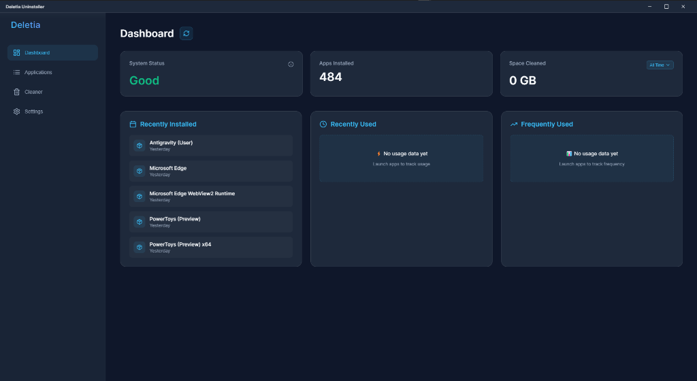
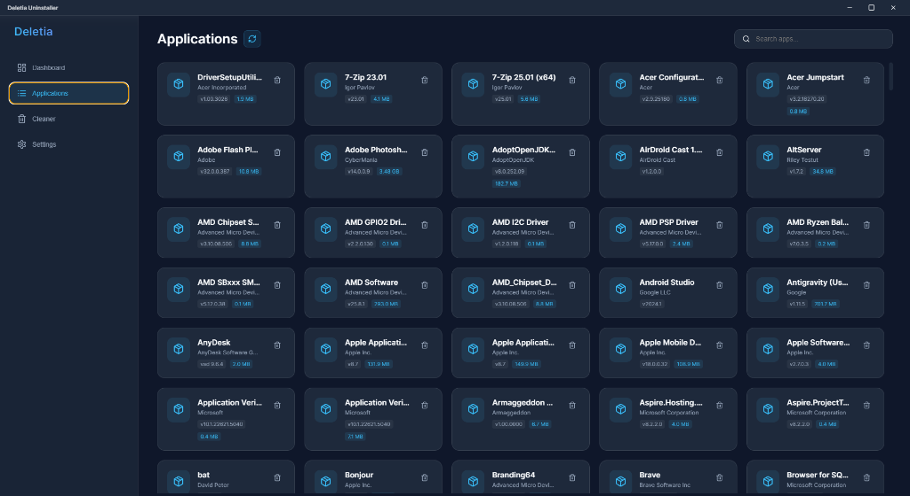
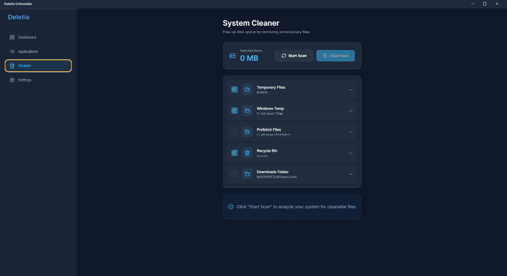
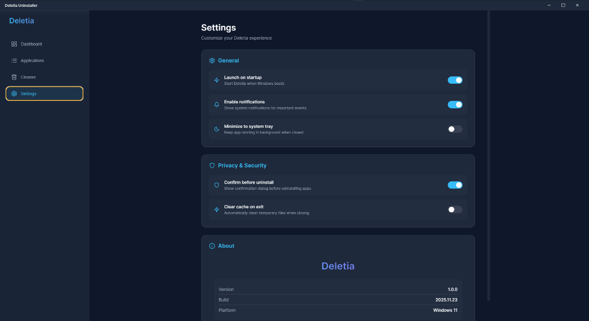

# Deletia Uninstaller

**A modern, lightweight, and powerful alternative to Revo Uninstaller.**

Deletia Uninstaller is designed to give you complete control over your Windows applications. With a sleek, modern interface and powerful cleaning capabilities, it ensures that when you uninstall an app, it's truly gone—no leftovers, no clutter.



## ✨ Features

- **🚀 Modern UI/UX**: A beautiful, dark-themed interface built with React and Electron.
- **🧹 Deep Cleaning**: Scans for and removes leftover files and registry entries after uninstallation.
- **⚡ Fast & Lightweight**: Optimized performance for quick scanning and removal.
- **🛡️ Privacy Focused**: Clean temporary files, prefetch data, and recycle bin with a single click.
- **⚙️ Smart Settings**: Configurable options like "Launch on Startup" and "Minimize to Tray".
- **📦 Portable Ready**: Can be packaged as a standalone executable.

## 📸 Screenshots

### Applications List

Manage all your installed applications in one place.


### System Cleaner

Free up disk space by removing temporary files and system junk.


### Settings

Customize your experience.


## 🛠️ Building from Source

To build Deletia Uninstaller yourself, follow these steps:

1.  **Clone the repository**

    ```bash
    git clone https://github.com/chairielazizi/Deletia-Uninstaller.git
    cd Deletia-Uninstaller
    ```

2.  **Install dependencies**

    ```bash
    npm install
    ```

3.  **Run in Development Mode**

    ```bash
    npm run dev:electron
    ```

4.  **Build for Windows**
    ```bash
    npm run build:win
    ```
    The installer will be generated in the `release/` directory.

## 📄 License

MIT License
